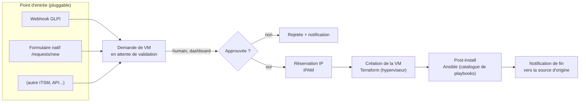

# Hephaestus

Provisioning de VM self-hosted, sans étape manuelle : une demande de VM → validation
humaine sur un dashboard web → réservation IP (IPAM) → création de la VM (Terraform) →
post-install (Ansible) → notification à la source de la demande.



**Scope actuel (v1)** : Proxmox + VM Linux, testé de bout en bout sur une vraie
infrastructure. VMware/vCenter et le post-install Windows (WinRM) existent en brouillon
dans le dépôt de playbooks mais n'ont jamais été exécutés contre un vrai vCenter — à
considérer comme non fonctionnel pour l'instant.

**Important sur le vocabulaire** : "GLPI" et "Proxmox" sont les **premiers** providers
implémentés pour chaque rôle (point d'entrée des demandes, hyperviseur), pas une limite
définitive du projet. L'IPAM est déjà construit comme une interface pluggable (phpIPAM
aujourd'hui, un autre backend demain sans toucher au reste du pipeline — voir
`backend/app/ipam/`). Le point d'entrée des demandes suit le même principe : le webhook
GLPI et le formulaire natif (`/requests/new`) créent tous les deux exactement le même
objet interne et suivent ensuite le même pipeline, sans distinction de traitement
derrière. L'hyperviseur, en revanche, **n'est pas encore abstrait dans le code** — voir
"Limites connues" plus bas.

**Licence** : voir [`LICENSE`](LICENSE) — publié pour évaluation/test, pas une licence
open-source permissive (voir ce fichier pour le détail).

**Sécurité** : voir [`SECURITY.md`](SECURITY.md) — état réel audité (ce qui est solide,
ce qui est un compromis assumé, ce qui manque), pas juste une liste de bonnes intentions.

## Ce que fait l'application

- Reçoit une demande de VM — webhook GLPI (`/webhooks/glpi`) **ou** formulaire natif du
  dashboard (`/requests/new`), les deux créent la même chose et suivent le même circuit
- La met en attente de validation par un humain sur un dashboard web


- Une fois approuvée : réserve une IP (phpIPAM par défaut, interface branchée pour
  d'autres providers IPAM), crée la VM via Terraform (provider Proxmox aujourd'hui), puis
  exécute un post-install Ansible (compte admin + clé SSH, fermeture de l'accès root en
  SSH, et les playbooks de ton choix)
- Notifie le ticket GLPI d'origine à chaque étape (approbation, rejet, fin de création) —
  silencieusement ignoré si la demande ne vient pas de GLPI
- Catalogue de playbooks gérable depuis l'interface (obligatoire/optionnel configurable
  par toi, pas figé dans le code), déploiement à la demande contre n'importe quel hôte de
  ton inventaire (pas seulement les VMs créées par ce pipeline), sortie en direct
  
- Connexions (Proxmox, phpIPAM, GLPI, dépôt Git de playbooks, LDAP) configurables depuis
  l'interface web ou en CLI, avec test de connexion intégré
  


## Prérequis

- Docker + Docker Compose
- Un cluster/nœud Proxmox accessible, avec un token API
- Un serveur phpIPAM (ou un autre IPAM — voir `backend/app/ipam/`, interface à
  implémenter pour brancher autre chose)
- Un dépôt Git accessible en SSH pour y stocker tes playbooks Ansible (le dépôt
  lui-même n'est pas fourni — voir plus bas)
- (Optionnel) Une instance GLPI avec l'API v2 (OAuth2) activée, si tu veux le flux
  ticket → VM plutôt qu'un appel API direct

## Quickstart

### 1. Configuration de base

```bash
cp .env.example .env
```

Édite `.env` : mets un vrai mot de passe Postgres, génère un `SESSION_SECRET` et un
`ANSIBLE_ADMIN_PASSWORD` avec :

```bash
python3 -c "import secrets; print(secrets.token_hex(32))"
```

### 2. Clés SSH

Deux clés dédiées, jamais la même — une pour déployer sur tes VMs, une pour récupérer tes
playbooks (lecture seule) :

```bash
mkdir -p .secrets
ssh-keygen -t ed25519 -f .secrets/vmprov_bastion_key -N "" -C "vmprov-automation"
ssh-keygen -t ed25519 -f .secrets/vmprov_gitea_key -N "" -C "vmprov-playbooks-fetch"
```

La clé publique de `vmprov_gitea_key` doit être ajoutée comme **deploy key en lecture
seule** sur ton dépôt de playbooks (GitHub : Settings → Deploy keys ; Gitea : Settings →
Deploy Keys).

### 3. Dépôt de playbooks

Ce dépôt n'inclut pas de playbooks Ansible tout prêts à exécuter en prod — chacun a sa
propre infra, ses propres outils (EDR, supervision...), donc ses propres playbooks. Crée
un dépôt Git séparé avec au minimum :

- `requirements.yml` (collections Ansible nécessaires)
- un playbook qui crée un compte admin + déploie une clé SSH sur une VM fraîche
- un playbook qui ferme l'accès root en SSH

Le catalogue de l'application (`/playbooks`) pointe vers des chemins dans ce dépôt —
chaque entrée est éditable depuis l'interface (chemin, catégorie obligatoire/optionnel,
description). Un playbook du catalogue dont le fichier n'existe pas encore dans ton dépôt
est simplement ignoré (log, pas d'erreur bloquante) — tu peux déclarer ton catalogue avant
d'avoir écrit le contenu.

### 4. Démarrage

```bash
docker compose up -d --build
```

Première ouverture sur `http://localhost:8000` : un compte admin est à créer au premier
lancement.

### 5. Connexions

Depuis `/connections` (ou en CLI, `python -m app.cli connection --help`) : configure ta
connexion Proxmox (URL API + token), ta connexion phpIPAM, ton dépôt de playbooks (URL
SSH), et GLPI si tu l'utilises. Chaque formulaire a un bouton "Tester la connexion" qui
affiche l'erreur précise en cas de souci.

## Architecture

```
backend/   FastAPI (dashboard + API), SQLAlchemy/Alembic, RQ (jobs async)
terraform/ Provider Proxmox (bpg/proxmox)
config/    Catalogue de playbooks, connexions (secrets jamais commités, voir .gitignore)
```

Le détail des décisions techniques prises au fil du développement est dans
[`JOURNAL.md`](JOURNAL.md) — utile pour comprendre le "pourquoi" d'un choix, pas un guide
d'installation.

## Limites connues

- **Hyperviseur non abstrait** : contrairement à l'IPAM (vraie interface + providers),
  `backend/app/provisioning/terraform_runner.py` est aujourd'hui câblé en dur pour
  Proxmox (chemin du module Terraform, variables, tout). Faire de VMware/Hyper-V/autre un
  second provider demanderait de construire la même abstraction que l'IPAM, pas juste
  d'écrire du Terraform en plus — pas fait.
- VMware/vCenter : code Ansible présent en brouillon (collections `community.vmware`),
  jamais testé contre un vrai vCenter
- Post-install Windows (WinRM, vérification d'agent) : brouillon, jamais testé
- L'abstraction IPAM supporte plusieurs backends dans l'interface, seul phpIPAM est
  implémenté pour de vrai aujourd'hui
- L'agrandissement de disque générique (LVM/partition) n'a pas été testé contre un hôte
  réel — vérifie sur une VM jetable avant tout usage en production
